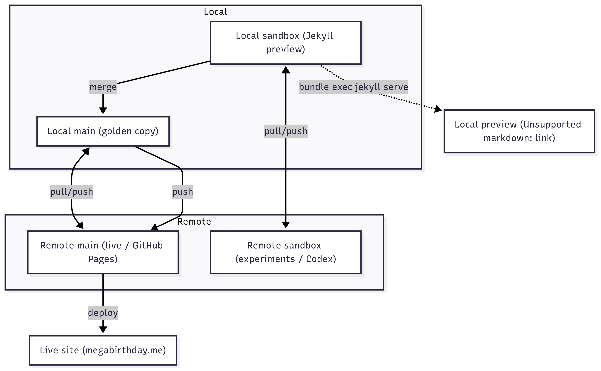

# megabirthday
Github Repo for megabirthday.me 

## 🔀 Git Workflow for Megabirthday

This project uses a two-branch model (`main` for production, `sandbox` for experiments).  
Here’s how changes flow between local and remote branches:



# Raw code

<details>
<summary>View Mermaid source</summary>

```mermaid
flowchart TD

    subgraph Local
        LMain["Local main (golden copy)"]
        LSandbox["Local sandbox (Jekyll preview)"]
    end

    subgraph Remote
        RMain["Remote main (live / GitHub Pages)"]
        RSandbox["Remote sandbox (experiments / Codex)"]
    end

    %% Sync paths
    LMain <-- pull/push --> RMain
    LSandbox <-- pull/push --> RSandbox

    %% Preview locally
    LSandbox -. "bundle exec jekyll serve" .-> Preview["Local preview (http://localhost:4000)"]

    %% Promotion to live
    LSandbox -->|merge| LMain
    LMain -->|push| RMain
    RMain -->|deploy| Live["Live site (megabirthday.me)"]
'''

</details>


